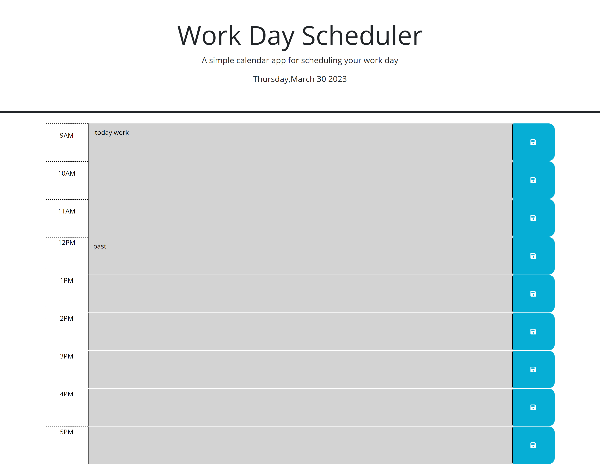

# work-day-scheduler

## Description

Work day scheduler had a partially built in HTML file with the times 9 am to 11 am. 
More times were added to the HTML from 12 pm to 5 pm. In JavaScript, functions were 
built to save information that is written as a text inside the boxes. Another function was built to make the save button click and save information.

## Screenshot of Work Day Scheduler

## Link to Work Day Scheduler
 https://jovaldez98.github.io/work-day-scheduler/